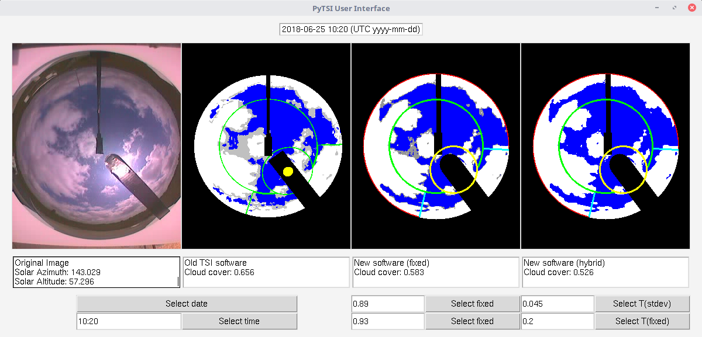

# PyTSI

For documentation on this project see [the documentation website](https://knmi-datalab.github.io/PyTSI/).

## User Interface


## Installation instructions:

* Clone the project:
    ```
    git clone https://github.com/KNMI-Datalab/PyTSI PyTSI
    ```

* Install the requirements:
  ```
  pip install -r requirements.txt
  ```

* Run the GUI using Python 3:
  ```
  python3 src/UI.py
  ```

* Run the recursive time loop:
  ```
  python3 src/main.py
  ```

* To change functionality and parameters, change the settings in `src/settings.py`
  
