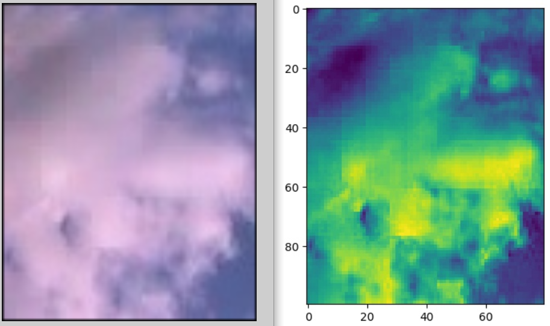

# cloudDetection

## Comparison of the original image, old TSI software and the new software

## Cloud cover comparison of the old and new software
### No mask around the sun

### With mask around the sun

## Result of JPG compression

## TSI image showing the Python set outlines

